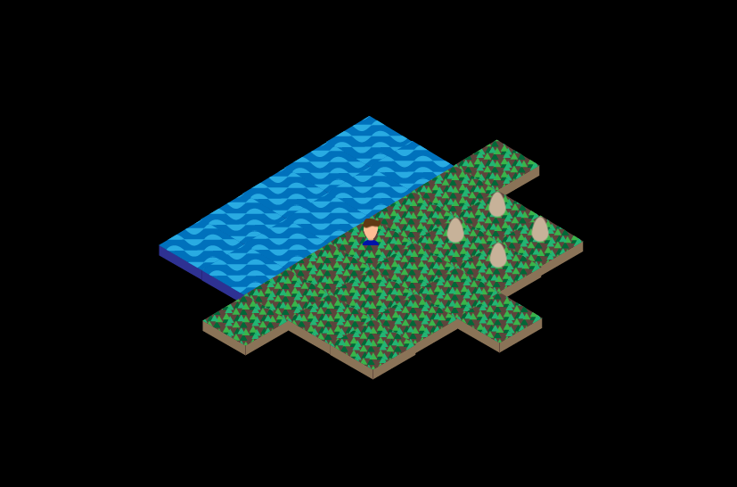

# Egg collector game

A game for searching and collecting eggs on a map.

The player can be moved around with arrow keys. Eggs are picked up by pressing the spacebar.

###  Project structure

The source code is in the `eggz` folder and is divided into three modules: gui, server and client. `gui` contains the source code to run the game locally.

### Building the projects

Build the gui

    gradle eggz:gui:build
    
Build the server

    gradle eggz:server:build

Build the client

    gradle eggz:client:build

Runnable jar are produced into `build/libs`. These can be run with

    java -jar <name of jar>
    

### GUI development notes
Project dependent on jfx, see [here](https://github.com/dice-group/LIMES/issues/56)

in Fedora install jfx  and its java dependencies with

    sudo dnf install openjfx java-1.8.0-openjdk-openjfx
    
Manifest attribute  for the jar file from [here](https://stackoverflow.com/questions/9689793/cant-execute-jar-file-no-main-manifest-attribute)

Get detailed output from graphics pipeline:

    java -jar -Dprism.verbose=true

from [here](https://stackoverflow.com/questions/18754803/how-to-disable-or-bypass-hardware-graphics-accelerationprism-in-javafx) and [here](https://stackoverflow.com/questions/21185156/javafx-on-linux-is-showing-a-graphics-device-initialization-failed-for-es2-s)

Understanding where the resources are [read](http://www.mytechnotes.biz/2012/08/understanding-absolute-and-relative.html)

Modularizing the project: [this](https://docs.gradle.org/current/userguide/multi_project_builds.html) and [this](https://rominirani.com/gradle-tutorial-part-3-multiple-java-projects-5b1c4d1fbd8d)

### Todo
- server configuration
- client configuration
- multiplayer
- lots more...

### Acknowledgements

This project is based on John Gowers' Java tutorial in Linux User & Developer 185. As that article was part four in the series, not everything on how it worked was clear (and the coverdisc only contained the code, not previous tutorials).

I've made some modifications to the original code, like using Gradle instead of Maven, rearranging the project into multiple modules, and probably other stuff as well.
